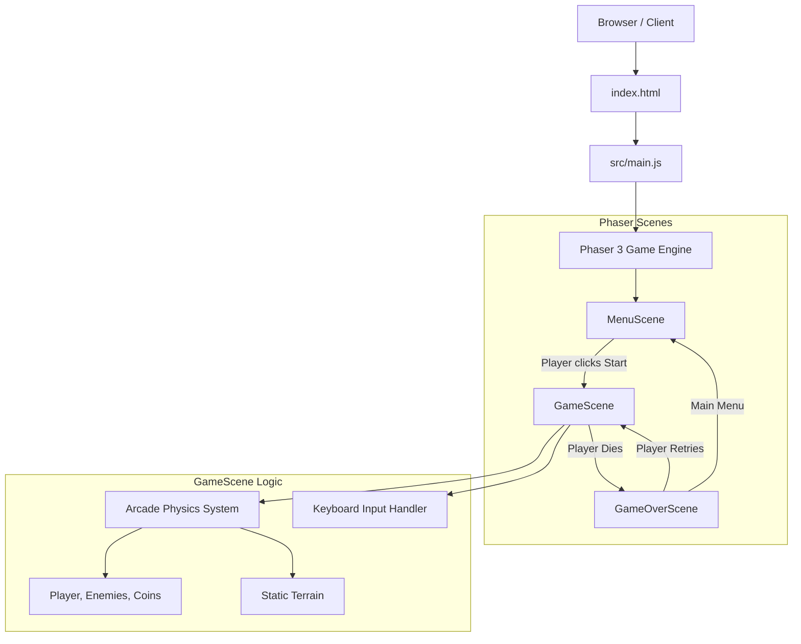
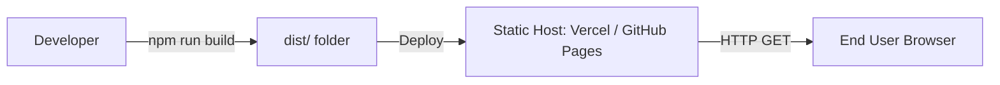

# System Architecture

**Treasure Hunters** is a client-side 2D browser game built with **Phaser 3** and bundled using **Vite**. The architecture is heavily reliant on the Phaser 3 Game Loop and its Scene Management system.

## System Overview

The game logic is entirely executed on the client's browser using HTML5 Canvas/WebGL. There is no backend server or database connected to this project, making it lightweight and highly portable.

## Architecture Diagram

Below is the high-level architecture diagram of the game using Mermaid:

## Scene Flow Explanation

1. **MenuScene**: The entry point of the game. It displays the title and a start button. It waits for user input before transitioning to the `GameScene`.
2. **GameScene**: The core component where the gameplay loop resides.
   - **Preload**: Loads all assets (images, spritesheets, audio) asynchronously before the game starts.
   - **Create**: Initializes game objects, sets up the Arcade Physics world, generates stages, and configures the camera.
   - **Update**: The game loop that runs every frame. Handles player movement, jumping logic, enemy patrols, and collision detection.
3. **GameOverScene**: Triggered when the player's health reaches zero or they fall out of bounds. Displays the final score and provides options to restart or go back to the menu.

## Physics & Rendering

- **Rendering**: Phaser automatically uses WebGL if available, and falls back to Canvas API.
- **Physics**: Uses Phaser's built-in **Arcade Physics** engine, which provides AABB (Axis-Aligned Bounding Box) collision detection for platforms, enemies, and the player.

## Deployment Architecture

Since the game is purely static (HTML, CSS, JS, and assets), deployment is straightforward. The `vite build` command compiles and minifies all assets into a `dist/` directory, which can be served by any static web host.

